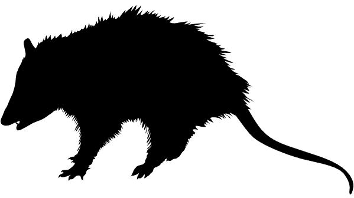
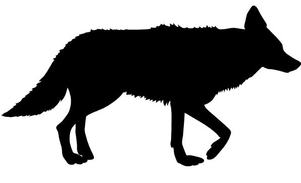
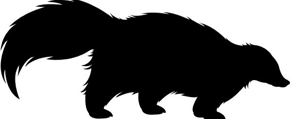

A repository for: 
================

Fidino et al. (*in press*). Landscape-scale differences among cities
alter common species’ responses to urbanization. Ecological
Applications.

---

 <h3>Scripts</h3> 

---

**This repository has 10 R Scripts used for this analysis. They will be in your working directory. These include:**

**sourcer.R:** This is a utility script to load packages (and install them if you do not have them) and sources **utility_script.R**, **plotting_utility.R**, and **prepare_data.R** in that order.

**utility_script.R:** This script holds custom functions. `package_load()` takes a vector of package names and loads them. If a package is not available it will install it. `HDIofMCMC()` calculates the highest density interval of a posterior. `inits()` is a function that generates initial values for `JAGS`. `initsimp()` is similar to `inits`, except for a null model. `calc_cpo()` calcualtes the conditional predictive ordinate of each data point and then summarises them for model selection.

**plotting_utility.R:** has plotting functions for **figure_2_through_4_script.R**

**prepare_data.R:** is a script that prepares the species detection data and covariates for a Bayesian analysis in `JAGS`.

**fit_grp_model.R:**  This is the only script you need to open and run to fit the data through the models. It'll also calcualte and store the CPO scores of each model, plus save MCMC outputs into a results folder (which will be created in your working directory if it does not exist).

**summarise_results.R:** This script summarises the output generated by **fit_grp_model.R**. If a `./results_summary` folder does not exist this script will create one and spit out 95% credible intervals of paramters into there.

**figure_1_script.R:** This creates figure_1 of the manuscript. It assumes there is a plot sub-folder.

**figure_2_through_4_script.R:** This creates species-specific plots of average occupancy and response to urbanization from the best fit model of each species. I then used imagemagick via the console to combine images, add species pictures, and format to the appropriate size.

**figure_5_script.R:** This creates a rough draft of figure 5, which was touched up a little bit in inkscape.

---

 <h3>Model</h3> 

---

**This repository has 1 JAGS model that we used for our analysis. It is located in the jags_models sub-folder of the working directory:**

**city_mean_occupancy.R:** This is a single-species hierarchical occupancy model with among-city effects.

---

 <h3>Data</h3> 

---

**There are 13 data files within the `data` sub-folder which are used in this analysis. Many of them have city codes, which are shorthand for a specific city. These city codes are:**

|city code| city name|
|---|---|
|`AUTX`|Austin, Texas|
|`CHIL`|Chicago, Illinois|
|`DECO`|Denver, Colorado|
|`FOCO`|Fort Collins, Colorado|
|`ICIA`|Iowa City, Iowa|
|`ININ`|Indianapolis, Indiana|
|`OCCA`|Orange County, California|
|`MAKS`|Manhattan, Kansas|
|`MAWI`|Madison, Wisconsin|
|`WIDE`|Wilmington, Delaware|

**The 13 data files are:**

**city_level_data.csv:** This csv has 2 columns and 10 rows (excluding the header) and contains information on the proportion of greenspace in a city.

| Column header | Data type | Description |
|---|---|---|
| `City`| Character | The city abbreviation.|
| `habitat` | Numeric | The proportion of greenspace in a city's study area. To calculate the proportion of available greenspace in a city’s study area, we followed the U.S. EPA’s EnviroAtlas definition (Pickard et al. 2015), by combining the forest, herbaceous, shrub & grass, and developed open space (e.g., golf courses, cemeteries, parks, etc.) land cover classes from the National Land Cover Database (Yang et al. 2016) and divided the summed area of those classes by the total sampled area for each city. See manuscript for additional details. |

Pickard, B. R., Daniel, J., Mehaffey, M., Jackson, L. E., and A. Neale. 2015. EnviroAtlas: a new geospatial tool to foster ecosystem services science and resource management. Ecosystem Services 14:44-55.

Yang, J. L., Jin, S., Danielson, P., Homer, C., Gass, L., Bender, S.M., Case, A., Costello, C., Dewitz, J., Fry, J. and M. Funk. 2018. A new generation of the United States National Landcover Database: requirements, research priorities, design, and implementation strategies. ISPRS Journal of Photogrammetry and Remote Sensing 146:108-123.

 
 

**detection_data.csv:** This csv has 13 columns and 808 rows (excluding the header) and contains information on the number of days each species was detected at a site. 

| Column header | Data type | Description |
|---|---|---|
| `city` | Character | The city abbreviation. |
| `site` | Character | The name code for each site. |
| `raccoon` | Numeric | The number of days raccoon (*Procyon lotor*) were detected at a site. |
| `coyote` | Numeric | The number of days coyote (*Canis latrans*) were detected at a site. |
| `rabbit` | Numeric | The number of days cottontail rabbits (*Sylvilagus floridanus* or *Sylvilagus audubonii*) were detected at a site. |
| `opossum` | Numeric | The number of days Virginia opossum (*Didelphis virginiana*) were detected at a site. |
| `skunk` | Numeric | The number of days striped skunk (*Mephitis mephitis*) were detected at a site. |
| `redfox` | Numeric | The number of days red fox (*Vulpes vulpes*) were detected at a site. |
| `graysquirrel` | Numeric | The number of days eastern gray squirrel (*Sciurus carolinensis*) were detected at a site. |
| `foxsquirrel` | Numeric | The number of days fox squirrel (*Sciurus niger*) were detected at a site. |
| `J` | Integer | The number of days the site was sampled. |
| `site_code` | Character | The unique (by city and location) code. |
| `year` | Integer | The year the site was sampled. |

**uwin_all_sites.csv:** This csv has 6 columns and 512 rows (excluding the header) and contains information to merge the site covariates that are in seperate city-specific files to one `data.frame` in `R`. 

|Column header | Data type | Description |
|---|---|---|
| `LocationID` | Numeric | A city-specific integer that is unique to each site within a city. Combined with the city abbreviation to make a unique site across cities. |
| `LocationName` | Character | The name code for each site. Is represented as `site` in **detection_data.csv** |
| `coords_x` | Numeric | x coordinates for a site. |
| `coords_y` | Numeric | y coordinates for a site. |
| `crs` | integer | epsg code for the coordinates. Some cities provided coordinates in WGS84 while others supplied site coordinates in UTM. |
| `City` | Character | The city abbreviation. |

The remaining csv files are site-specific covariates for each city. They all follow the same format and have 3 columns, though the number of rows is equivalent to the number of sites for each city. The file names is `{CITYCODE}covs.csv` where `{CITYCODE}` is one of the city-specific abbreviations (e.g., `AUTXcovs.csv` is the covariates for Austin, Texas). 

|Column header | Data type | Description |
|---|---|---|
| `site` | Character | The name code for each site. |
| `city` | Character | The city abbreviation. |
| `hd_1000` | Numeric | Housing density within a 1000m circular buffer around each site. Number of units per square kilometer. Calculated from Silvis lab. http://silvis.forest.wisc.edu/data/housing-block-change/|

---

 <h3>Miscellaneous</h3> 

---

There are a few other files kicking around this repo. They are either for a bit of flavor (e.g., silhouettes of animals in the `./images` sub-folder, or my line drawings in species specific folders nested in `./plots`). Some of the other stuff is created by running fitting the model (e.g., `cpo_scores.csv`). 

